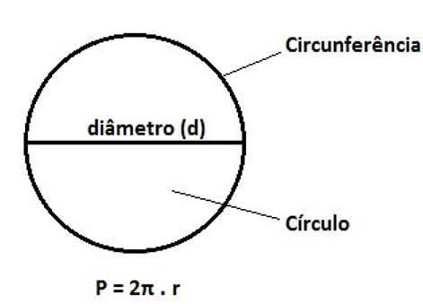
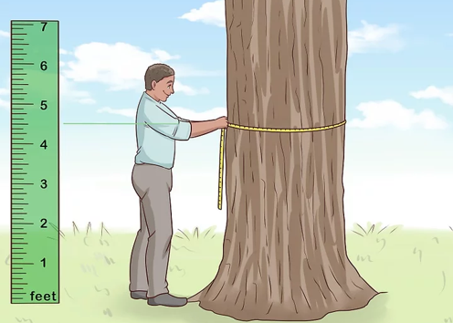
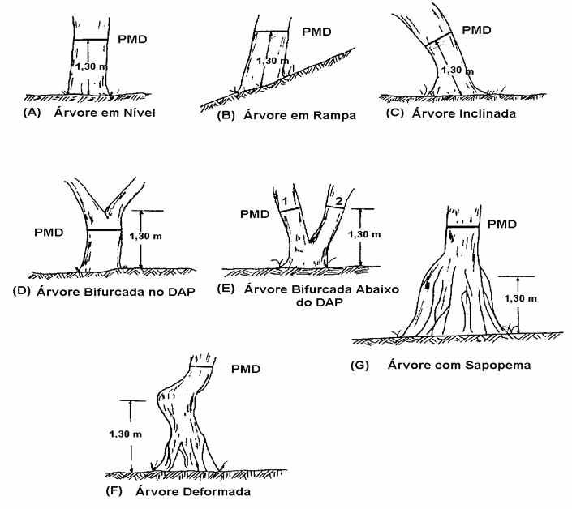
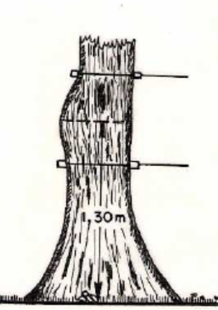
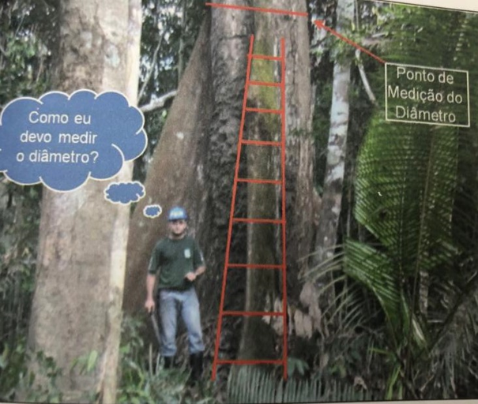
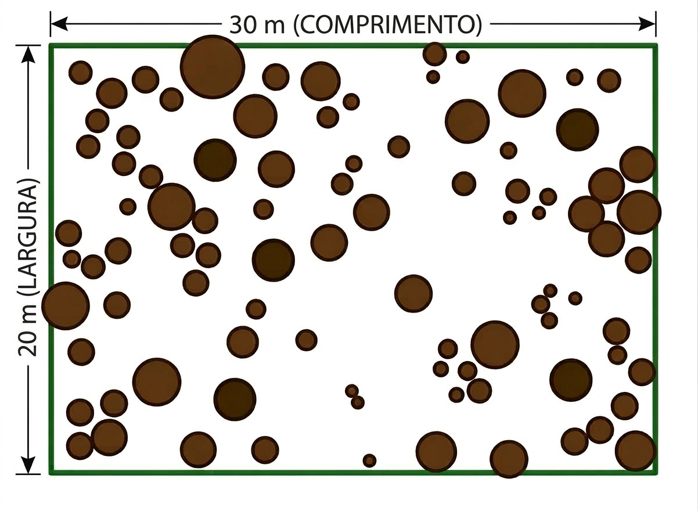

# AULA DE HOJE {.secao} 

## Aula de hoje

- [UNIDADE 2 - DIÂMETRO]{.alert}
    
    2.1 - Diâmetro das árvores e a área basal.
    
    2.2 - Medição do diâmetro.


# DIÂMETRO {.secao}

## Diâmetro

- Diâmetro é a [variável de maior importância]{.alert} na [Dendrometria]{.fg};

- [Possui relação]{.alert} com [diversas outras medidas]{.fg} de uma árvore;

- É possivelmente a variável de [mais fácil medição]{.alert} de uma árvore.


## Diâmetro
### Diâmetro ou circunferência

::: {layout-ncol=2}



:::


## Diâmetro

Tanto [diâmetro quanto circunferência]{.alert} podem ser utilizadas, pois são [facilmente intercambiáveis]{.fg}.

$$
c = 2\pi r   \quad e \quad d = 2r \quad \text{portanto} \quad r = {d \over 2}
$$

:::{.fragment}
$$
c = 2\pi {d\over 2} \quad \rightarrow \quad c = \pi d  \quad \text{portanto} \quad d = {c \over \pi}
$$
:::


## Diâmetro
### DAP

:::{.callout-tip}
## Por que "altura do peito"?

:::{style="font-size: 40px;"}
|       **País**       | **Altura de Medição** |
|:--------------------:|:---------------------:|
| Países que usam o SI |         1,30 m        |
|     EUA e Canadá     |         1,37 m        |
|      Inglaterra      |         1,29 m        |
|         Japão        |         1,25 m        |
:::

:::

## Diâmetro
### Símbolos

::: {style="font-size: 30px;"}
|     Variáveis e Símbolos | Variáveis e Símbolos |
|--------------------------------------------------|--------------------------------------|
| $c$ = $CAP$ circunferência à 1,3 altura (cm);                                                           | $g$ = área transversal do indivíduo à   1,3 altura (m²)                                             |
| $d$=$DAP$ =   diâmetro à 1,3 altura (cm)                                                            | $G_{u.a}$ =   área basal Unid.   Amostral   (m²/u.a); G   = área basal do povoamento (m²/ha);    |
| $d_g$ = $d_q$ = diâmetro médio ou diâmetro da árvore de área transversal média, diâmetro   quadrático;    | $d_{0,6h}$   = diâmetro tomado à 60% da altura total;                                            |
| $\bar{d}$ = $d_{médio}$ = diâmetro médio aritmético                                                            | $d_{0,1h}$   = diâmetro tomado à 10% da altura total;                                            |
| $d_w$   = diâmetro de Weisse;                                                                      | $d_{0,1}$ = diâmetro tomado à 10cm da altura;                                                  |
| $d_z$   = diâmetro da árvore com área transversal mediana;                                               | $d_4$   = diâmetro tomado à 4m de altura;                                                      |
| $d^+$ e $d^-$ = diâmetro de Hohenadl;                                                                 | $d_s$ = diâmetro sem casca                                                                     |

:::


## Instrumentos de Medição

Existe uma miríade de [instrumentos de medição]{.fg} de diâmetro (pelo menos 12). Os principais são:

\  

- [Suta]{.bg}

- [Fita métrica]{.bg}

## Instrumentos de Medição
### Suta

::::{.columns}

:::{.column width="50%"}
:::{style="font-size: 30px;"}
- A Suta consiste de uma régua graduada conectada a dois braços perpendiculares, sendo um fixo e o outro móvel. 


- Para a correta medição do diâmetro das árvores, é importante que a Suta esteja em posição perpendicular ao eixo do fuste da árvore.

- Idealmente deve-se realizar uma [medição cruzada]{.fg} da suta e tirar a média.
:::
:::

:::{.column width="50%"}
](https://assets.intergiro.net.br/arquivos/soilcontrol/produtos/zoom/suta-florestal-mecanica-de-500mm_69cfe3bb-7da4-4407-9391-53ab5bf58062.jpg){width=80%}
:::
::::

## Instrumentos de Medição
### Fita métrica

::::{.columns}
:::{.column width="50%"}
:::{style="font-size: 30px;"}
- A Fita Métrica é utilizada para a medição da circunferência da árvore. 

\  

- Neste caso, o diâmetro é obtido pelo desenvolvimento da relação matemática CAP dividido por $\pi$
:::
:::
:::{.column width=50%}
](https://grafittiartes.vteximg.com.br/arquivos/ids/185140-1000-1000/7893946067496.jpg?v=635735927250200000)
:::
::::

## Instrumentos de Medição
### Fita diamétrica

Existe também a [fita diamétrica]{.alert}, que fornece diretamente o valor do diâmetro.

](https://www.brasil.bioweb.co/cdn/shop/files/JIMG-59571_2048x.webp?v=1735860943)

## Instrumentos de Medição
### Fita diamétrica

:::{.callout-caution}
## Fita métrica vs. fita diamétrica
- Veja que $d = {c \over \pi}$.

- O erro de $1$ cm em circunferência equivale a $d = {1 \over \pi} = 0.318$ cm em diâmetro.

- O erro de $1$ cm em diâmetro é $1$ cm em diâmetro.
:::

## Instrumentos de Medição
### Cintas dendrométricas (acompanhamento contínuo)

](assets/FitasDendrometricas.png)

## Instrumentos de Medição
### Novas Tecnologias

/i.s3.glbimg.com/v1/AUTH_7d5b9b5029304d27b7ef8a7f28b4d70f/internal_photos/bs/2021/3/i/BpcntdQjCNLTiMrwBA8Q/img-0787.jpg)](https://s2-umsoplaneta.glbimg.com/Vzwg9cfEDhKRZ4shpfmiwLc7ZjU=/0x0:2816x1584/924x0/smart/filters:strip_icc()/i.s3.glbimg.com/v1/AUTH_7d5b9b5029304d27b7ef8a7f28b4d70f/internal_photos/bs/2021/3/i/BpcntdQjCNLTiMrwBA8Q/img-0787.jpg)

## Instrumentos de Medição
### Novas Tecnologias

](https://i0.wp.com/www.katam.se/wp-content/uploads/2022/09/Untitled-8.png?ssl=1)


## Ponto de Medição do Diâmetro - PMD
### Onde medir

- Sempre [desejamos]{.fg} medir $d$ à 1,3m acima do nível do solo, mas [nem sempre]{.alert} isso é possível.

- O [Ponto de Medição do Diâmetro (PMD)]{.alert} varia a depender das [condições encontradas em campo]{.fg}.


## Ponto de Medição do Diâmetro - PMD




## Ponto de Medição do Diâmetro - PMD




## Ponto de Medição do Diâmetro - PMD




## Erros de Medição

:::{.callout-warning}
## Erros de medição
É preciso tomar cuidado com [Erros de medição!]{.bg}. Podem ser causados por:

- [Sutas mal posicionadas]{.fg}

- [Fita muito solta (formando barriga)]{.fg}

- [Instrumentos não aferidos ou com problemas]{.fg}

:::


# Área Transversal {.secao}
## Área Transversal

A área transversal é definida como [toda a área compreendida por um círculo de raio r]{.fg}.

](assets/PontosCirculo.png)

## Área Transversal

Se pensarmos na área ($g$) [em função do diâmetro]{.fg}, podemos reescrever a área de um círculo como

$$
d = 2r \quad  \rightarrow \quad  r = {d\over 2} \text{e} g = \pi r^2 \quad \text{, portanto}
$$

$$
g = \pi \left({d \over 2}\right)^2  \quad \rightarrow \quad g = \pi {d^2 \over 4} \quad \rightarrow \quad g = {d^2\pi \over 4}
$$

## Área Transversal

:::{.callout-warning}
## Cuidado com as unidades!
- Se $d$ é fornecido em centímetros ($cm$), então $g$ será $cm^2$.

- Se $d$ é fornecido em metros ($m$), então $g$ será $m^2$.

Como [sempre utilizamos $g$ em $m^2$]{.fg}, é possível converter diretamente $cm \rightarrow m^2$ acrescentando o fator de conversão na fórmula

$$
g = {d^2 \pi \over 40000}
$$

Portanto se $DAP$ estiver em $cm$, utiliza-se $g = {d^2 \pi \over 40000}$, caso contrário utiliza-se $g = {d^2 \pi \over 4}$. 
:::


## Diâmetro e Área Transversal



## Diâmetro e Área Transversal



## Exercícios

:::{.callout-caution}
## Exercícios
Calcule a área transversal de cada medida abaixo

- $DAP = 30 cm$

- $d = 0,07 m$

- $CAP = 78 cm$

- $c = 232 cm$

- $d = 42 cm$
:::

## Exercícios

:::{.callout-caution}
## Exercícios
Calcule a área transversal de cada medida abaixo

- $DAP = 30 cm \qquad \quad R = 0,0706 m^2$

- $d = 0,07 m \qquad \quad \enspace R = 0,0038 m^2$

- $CAP = 78 cm \qquad \quad  R = 0,0483 m^2$

- $c = 232 cm \qquad \quad R = 0,4283 m^2$

- $d = 42 cm\qquad \quad R = 0,1385 m^2$
:::


# Médias dendrométricas {.secao}
## Volume de dados
### Considere o seguinte cenário

::: {style="font-size: 35px;"}
```{r}
library(knitr)
dados <- read.csv2('assets/dados_teca.csv')
dados$arvore <- 1:nrow(dados)
dat <- dados[,c('arvore', 'd')]
colnames(dat) <- c('Árvore', 'DAP (cm)')
dat1 <- dat[1:12,]
dat2 <- dat[13:24, ]
dat3 <- dat[25:36, ]
dat4 <- dat[37:46,]
kable(list(dat1, dat2, dat3, dat4), row.names=F)
```
:::

## Volume de dados
### Considere agora dados agrupados

::::{.columns}
::: {.column width="50%"}
::: {style="font-size: 30px;"}
```{r}
dat <- dados[,c('Parcela', 'd', 'Va')]
dat$Va <- round(dat$Va, 0)
colnames(dat) <- c('Parcela', 'DAP (cm)', 'N')
kable(dat[sample(1:nrow(dat),10, replace = F),], row.names = F)
```
:::
:::
:::{.column width="50%"}
:::{.fragment}
[Cada parcela possui $N$ indivíduos]{.fg}, todos representados pelo respectivo diâmetro apresentado.
:::
:::
::::

## Volume de dados {.nostretch}
### Considere agora dados agrupados

```{r}
library(ggplot2)
library(plotly)

x <- rep(dat$`DAP (cm)`, dat$N)

g <- ggplot() +
  geom_histogram(aes(x=x), fill='steelblue', color='steelblue', 
                 alpha = 0.7, bins = 5) +
  labs(x='Classes de Diâmetro (cm)', y = 'Frequência') +
  theme_bw() + ggpubr::theme_transparent() +
  theme(panel.grid = element_blank(),
        axis.title = element_text(color='black', face='bold'),
        axis.text = element_text(color='black'),
        plot.background = element_rect(fill = 'transparent', color=NA),
        panel.background = element_rect(fill = 'transparent', color = NA))

ggplotly(g)

``` 

## Dados Agrupados

As informações obtidas à campo podem vir nas formas de:

- [Dados Não Agrupados (DNA)]{.alert}: onde cada diâmetro representa [uma única árvore]{.fg};

- [Dados Agrupados (DA)]{.alert}: onde cada diâmetro [representa $N$ (ou $n$) árvores]{.fg}.

## Médias dendrométricas

- Somentes os números soltos não fornecem resultados proveitosos.

- Existem [médias de um ou mais elementos dendrométricos]{.fg} que podem [descrever e resumir]{.fg} a informação contida nos números.


## Médias dendrométricas {.smaller}
### Média aritmética


$$
\bar{d} = {d_1 + d_2 + \cdots + d_n \over n} = {\displaystyle\sum_{i=1}^n d_i \over n}
$$
Para [Dados Agrupados]{.fg}:

$$
\bar{d} = {d_1.n_1 + d_2.n_2 + \cdots + n_k.d_k \over n_1 + n_2 + \cdots + n_k} = {\displaystyle\sum_{i=1}^k n_id_i \over \displaystyle\sum_{i=1}^k n_i}
$$


## Médias dendrométricas

::::{.columns}
:::{.column width="50%"}
:::{style="font-size: 30px;" }
```{r}
library(kableExtra)
d <- c(17,19.6, 7.5, 16.1, 9.2, 9.4, 5.4, 8.4, 13.8, 10.2, 18.9, 23.6, 20.4)
soma <- sum(d)
dados_orig <- data.frame('Ordem' = 1:length(d), 'DAP' = d)
dados <- dados_orig
kable(dados,
      col.names = c('Ordem', 'DAP (cm)'), row.names = F,
      format='html') %>% 
  kable_styling(bootstrap_options=c('striped', 'hover', 'condensed', 'responsive'), full_width=F)

```
:::
:::

:::{.column width="50%"}
Calcular o diâmetro médio $\bar{d}$.

:::{.fragment}

$n$ = `r length(d)`

Soma:$\displaystyle\sum_{i=1}^{13} d_i$ =   `r soma`

$\bar{d} = {1\over n} \displaystyle\sum_{i=1}^{13} d_i = {`r soma` \over `r length(d)`} = `r round(soma/length(d),1)` cm$
:::
:::
::::

## Médias dendrométricas
### Área transversal média


É a [média das áreas transversais]{.alert}.

$$
\bar{g} = {g_1 + g_2 + \cdots + g_n \over n} = {\displaystyle\sum_{i=1}^n g_i \over n}
$$

## Médias dendrométricas

::::{.columns}
:::{.column width="50%"}
```{r }
dados$g <- ''

kable(dados, col.names = c('Ordem', 'DAP (cm)', 'g (m²)'), row.names=F) %>% 
  kable_styling(full_width=F, font_size = 25)

```
:::

:::{.column width="50%"}
Calcule a área transversal média $\bar{g}$. 

Lembre que $g_i = {d_i^2\pi \over 40000}$
:::
::::


## Médias dendrométricas

::::{.columns}
:::{.column width="50%"}
```{r }
dados$g <- round(dados$DAP^2*pi/40000,4)

kable(dados, col.names = c('Ordem', 'DAP (cm)', 'g (m²)'), row.names=F) %>% 
  kable_styling(full_width=F, font_size = 25) %>% 
  column_spec(3, bold=TRUE)

```
:::

:::{.column width="50%"}
$g_1 = {`r dados[['DAP']][1]`^2\pi \over 40000} = `r dados$g[1]`$

$g_2 = {`r dados[['DAP']][2]`^2\pi \over 40000} = `r dados$g[2]`$

$$ \vdots $$

$g_{13} = {`r dados[['DAP']][13]`^2\pi \over 40000} = `r dados$g[13]`$
:::
::::

## Médias dendrométricas

::::{.columns}
:::{.column width="50%"}
```{r }
dados$g <- round(dados$DAP^2*pi/40000,4)
soma <- sum(dados$g)
gm <- round(mean(dados$g),4)

dg <- round(sqrt(gm*40000/pi),1)

kable(dados, col.names = c('Ordem', 'DAP (cm)', 'g (m²)'), row.names=F) %>% 
  kable_styling(full_width=F, font_size = 25) %>% 
  column_spec(3, bold=TRUE)

```
:::

:::{.column width="50%"}
:::{style="font-size: 30px;"}
$\bar{g} = {\displaystyle\sum_{i=1}^{n}g_i \over n}$

:::{.fragment}
$\displaystyle\sum_{i=1}^{13} g_i = `r soma`$

$\bar{g} = {\displaystyle\sum_{i=1}^{13} g_i \over n} = {`r soma` \over `r length(d)`} = `r gm` m^2$
:::

:::
:::
::::

## Médias dendrométricas {.smaller}
### Área transversal média

Veja que a área transversal média $\bar{g}$ pode ser reescrita como

$$
\bar{g} = {1 \over n}\left(g_1 + g_2 + \cdots + g_n\right)
$$

$$
\bar{g} = {1 \over n}\left({d_1^2\pi\over 40000} + {d_2^2\pi \over 40000} + \cdots + {d_n^2\pi \over 40000} \right)
$$

:::{.fragment}
$$
\bar{g} = {1 \over n} {\pi \over 40000} \left( d_1^2 + d_2^2 + \cdots + d_n^2 \right)
$$
:::

## Médias dendrométricas
### Diâmetro de área transversal média

O diâmetro de área transversal média ($d_g$) é definido como o [diâmetro equivalente da área tranversal média]{.alert}. 

$$
g = {d^2\pi \over 40000}
$$

$$
\bar{g} = {d_g^2\pi \over 40000}
$$

## Médias dendrométricas
### Diâmetro de área transversal média

$$
\bar{g} = {d_g^2\pi \over 40000} \quad \rightarrow \quad d_g^2 = {\bar{g}.40000 \over \pi}
$$

Portanto

$$
d_g = \sqrt{\bar{g} . 40000 \over \pi}
$$


## Médias dendrométricas
### Diâmetro de área transversal média

No nosso exemplo, $\bar{g} = `r gm`$ m², portanto

$d_g = \sqrt{`r gm` \times 40000 \over \pi} = `r dg`$ cm


## Médias dendrométricas {.smaller}
### Diâmetro de área transversal média
Se $\bar{g} = {1 \over n} {\pi \over 40000} \left( d_1^2 + d_2^2 + \cdots + d_n^2 \right)$, então

$$
\bar{g} = {1 \over n} {\pi \over 40000} \left( d_1^2 + d_2^2 + \cdots + d_n^2 \right) = {d_g^2 \pi \over 40000}
$$
Portanto

$$
d_g^2 = {1 \over n} {\pi \over 40000} \left( d_1^2 + d_2^2 + \cdots + d_n^2 \right) {40000 \over \pi}
$$
$$
d_g^2 = {1 \over n} \left(d_1^2 + d_2^2 + \cdots + d_n^2 \right) \quad \rightarrow \quad d_g = \sqrt{\displaystyle\sum_{i=1}^n d_i^2 \over n}
$$


## Médias dendrométricas
### Diâmetro de área transversal média

O $d_g$ sempre será maior que a média aritmética $d$




## Médias dendrométricas
### Diâmetro da árvore média de Weise

\  

- Situa-se a [60% da distribuição]{.alert} dos diâmetros

- Requer colocar os diâmetros [em ordem crescente]{.fg}.

## Médias dendrométricas
### Diâmetro da árvore média de Weise

::::{.columns}
:::{.column width="50%"}
```{r}
dados <- dados[order(dados$DAP),]
pw <- nrow(dados)*0.6
dados$Ordem <- 1:nrow(dados)
kable(dados[,-3], format='html', align=c('c', 'c'),
      row.names=F, col.names = c('Nova Ordem', 'DAP')) %>% 
 kable_classic(lightable_options = c('striped', 'hover'), 
               full_width=F, font_size=23) %>% 
  column_spec(1, width='3cm') %>% 
  column_spec(2, width='3cm')

```
:::
::: {.column width="50%"}
::: {style="font-size: 30px;"}
:::{.fragment}
- Primeiro passo é [identificar a posição (ordem) que representa 60% da distribuição]{.alert}

$$
n \times 0.6 = 13 \times 0.6 = `r round(nrow(dados)*0.6, 2)`
$$
:::
:::{.fragment}
$$
\begin{array}{l}
`r floor(pw)` \quad \rightarrow \quad `r dados$DAP[floor(pw)]` \\
`r pw` \quad \rightarrow \quad d_w \\
`r ceiling(pw)` \quad \rightarrow \quad `r dados$DAP[ceiling(pw)]`
\end{array}
$$
:::
:::
:::

::::


## Médias dendrométricas
### Diâmetro da árvore média de Weise

:::: {.columns}
::: {.column width="50%"}
```{r}
dados <- dados[order(dados$DAP),]
dados$Ordem <- 1:nrow(dados)
kable(dados[,-3], format='html', align=c('c', 'c'),
      row.names=F, col.names = c('Nova Ordem', 'DAP')) %>% 
 kable_classic(lightable_options = c('striped', 'hover'), 
               full_width=F, font_size=23) %>% 
  column_spec(1, width='3cm') %>% 
  column_spec(2, width='3cm') %>% 
  row_spec(c(7:8), bold=TRUE, color = 'red')
```

:::
::: {.column width="50%"}
::: {style="font-size: 25px;"}

$$
\begin{array}{l}
`r floor(pw)` \quad \rightarrow \quad `r dados$DAP[floor(pw)]` \\
`r pw` \quad \rightarrow \quad d_w \\
`r ceiling(pw)` \quad \rightarrow \quad `r dados$DAP[ceiling(pw)]`
\end{array}
$$

:::{.fragment}
$$
{8-7 \over 7.8-7} = {16.1-13.8 \over d_w-13.8}
$$
:::
:::{.fragment}
$$
{1 \over 0.8} = {2.3 \over d_w-13.8}
$$
:::
:::{.fragment}
$$
d_w-13.8 = {2.3 \times 0.8 \over 1} 
$$
$$
d_w =  1.84 + 13.8 = 15.64 \enspace cm
$$

:::
:::
:::
::::


## Médias dendrométricas
### Diâmetro da área transversal central $d_z$

\  

- Medida [similar]{.alert} ao [diâmetro quadrático médio ($d_g$)]{.fg}, porém utilizando a área transversal que representa metade do acúmulo em área.

- Essa área transversal central é obtida pela metade do valor acumulado de área transversal.

## Médias dendrométricas
### Diâmetro da área transversal central $d_z$

:::: {.columns}
::: {.column width="40%"}
::: {.tabela-esquerda}
```{r}

dados$gac <- cumsum(dados$g)

kable(dados, col.names = c('Nova Ordem', 'DAP (cm)', 'g (m²)', 'gacum (m²)'),
      align = c('c', 'c', 'c', 'c'), row.names = F) %>% 
  kable_styling(bootstrap_options = c('striped', 'hover'), full_width = F,
                font_size = 22) %>% 
  column_spec(1:4,width='3cm')
```
:::
:::

::: {.column width="60%"}
:::{style="font-size: 25px;"}
- Primeiro passo é [encontrar a área transversal central]{.fg}

:::
:::
::::


## Médias dendrométricas
### Diâmetro da área transversal central $d_z$

:::: {.columns}
::: {.column width="40%"}
::: {.tabela-esquerda}
```{r}

dados$gac <- cumsum(dados$g)
df2 <- dados
df2[nrow(dados), 4] <- cell_spec(dados[nrow(dados),4], bold=TRUE, color='red')

kbl(df2, col.names = c('Nova Ordem', 'DAP (cm)', 'g (m²)', 'gacum (m²)'),
      align = c('c', 'c', 'c', 'c'), row.names = F, escape=F) %>% 
  kable_styling(bootstrap_options = c('striped', 'hover'), full_width = F,
                font_size = 22) %>% 
  column_spec(1:4,width='3cm')
```
:::
:::

::: {.column width="60%"}
:::{style="font-size: 25px;"}
- Primeiro passo é [encontrar a área transversal central]{.fg}

$$
`r dados$gac[nrow(dados)]` \times 0.5 = `r dados$gac[nrow(dados)]/2` m^2
$$

:::{.fragment}
[Isso quer dizer que `r dados$gac[nrow(dados)]/2` é o ponto que acumula 50% da área transversal]{.alert}.
:::
:::
:::
::::


## Médias dendrométricas
### Diâmetro da área transversal central $d_z$

:::: {.columns}
::: {.column width="40%"}
::: {.tabela-esquerda}
```{r}

dados$gac <- cumsum(dados$g)
df2 <- dados
df2[nrow(dados), 4] <- cell_spec(dados[nrow(dados),4], bold=TRUE, color='red')

kbl(df2, col.names = c('Nova Ordem', 'DAP (cm)', 'g (m²)', 'gacum (m²)'),
      align = c('c', 'c', 'c', 'c'), row.names = F, escape=F) %>% 
  kable_styling(bootstrap_options = c('striped', 'hover'), full_width = F,
                font_size = 22) %>% 
  column_spec(1:4,width='3cm') %>% 
  row_spec(9:10, bold=TRUE, color='steelblue')
```
:::
:::

::: {.column width="60%"}
:::{style="font-size: 25px;"}
```{r}

df3 <- data.frame(DAP = c('17.0', '\\(d_z\\)', "18.9"),
                  gacum = c(0.0920, 0.11335, 0.1201))

kbl(df3, row.names = F, col.names = c('DAP (cm)', 'gacum (m²)'),
    align=c('c', 'c'), escape=F) %>% 
  kable_classic(lightable_options = c('hover', 'striped'), full_width=F,
                font_size = 22) %>% 
  column_spec(1:2, width = '3cm')

```

:::{.fragment}
$$
{18.9-17 \over d_z - 17}  = {0.12010 - 0.09200 \over  0.11335 - 0.0920}
$$
:::

:::{.fragment}
$$
{1.9 \over d_z-17} = {0.0281 \over 0.02135}
$$

$$
d_z-17 = {1.9 \times 0.02135 \over 0.0281} \rightarrow d_z = 1.443594 + 17 = \color{#027FA8}{18.4 cm}
$$
:::
:::
:::
::::


## Médias dendrométricas
### Diâmetros de Hohenadl $d^-$ e $d^+$


- São calculados como a [média aritmética mais ou menos um desvio padrão]{.alert}

$$
S^2 = {\displaystyle\sum_{i=1}^n x_i^2 - {\left(\sum_{i=1}^n x_i \over n \right)^2} \over n-1}
$$

$$
S = \sqrt{S^2}
$$


## Médias dendrométricas
### Diâmetros de Hohenadl $d^-$ e $d^+$

::::{.columns}
::: {.column width="40%"}
```{r}
dados <- dados_orig
m <- mean(dados$DAP)
vd <- var(dados$DAP)
s <- sqrt(vd)
dados$DAP2 <- dados$DAP^2
df <- rbind(dados, data.frame('Ordem' = 'Soma', 'DAP' = sum(dados$DAP), 'DAP2' = sum(dados$DAP2)))
kbl(df, row.names=F, align=c('c', 'c', 'c')) %>% 
  kable_classic(full_width=F, font_size=22) %>% 
  column_spec(1:3, width='3cm') %>% 
  row_spec(13, hline_after=TRUE) %>% 
  row_spec(nrow(df), bold=TRUE)

```
:::

::: {.column width="60%"}
::: {style="font-size: 30px;"}
$$
\bar{d} = {179.5 \over 13} = `r round(mean(dados$DAP), 2)`
$$
$$
S^2 = {2886.15 - \left({179.5 \over 13}\right)^2 \over 13-1} = `r round(vd, 4)` cm^2
$$

$$
S = \sqrt{`r vd`} = `r round(sqrt(vd), 2)` cm
$$

$$
\textcolor{#027FA8}{d^-} = \bar{d} \textcolor{#027FA8}{-} S \quad \text{e} \quad \textcolor{#FF0000}{d^+} = \bar{d} \textcolor{#FF0000}{+ }S
$$
:::
:::

::::


## Médias dendrométricas
### Diâmetros de Hohenadl $d^-$ e $d^+$

::::{.columns}
::: {.column width="40%"}
```{r}
dados <- dados_orig
m <- mean(dados$DAP)
vd <- var(dados$DAP)
s <- sqrt(vd)
dados$DAP2 <- dados$DAP^2
df <- rbind(dados, data.frame('Ordem' = 'Soma', 'DAP' = sum(dados$DAP), 'DAP2' = sum(dados$DAP2)))
kbl(df, row.names=F, align=c('c', 'c', 'c')) %>% 
  kable_classic(full_width=F, font_size=22) %>% 
  column_spec(1:3, width='3cm') %>% 
  row_spec(13, hline_after=TRUE) %>% 
  row_spec(nrow(df), bold=TRUE)

```
:::

::: {.column width="60%"}
::: {style="font-size: 30px;"}
$$
\textcolor{#027FA8}{d^-} = \bar{d} \textcolor{#027FA8}{-} S \quad \text{e} \quad \textcolor{#FF0000}{d^+} = \bar{d} \textcolor{#FF0000}{+} S
$$

$$
\textcolor{#027FA8}{d^-} = `r round(m,1)` \textcolor{#027FA8}{-} `r round(s, 2)` = \textcolor{#027FA8}{`r round(m - s, 1)`} cm
$$

$$
\textcolor{#FF0000}{d^+} = `r round(m, 1)` \textcolor{#FF0000}{+} `r round(s, 2)` = \textcolor{#FF0000}{`r round(m + s, 1)`} cm
$$
:::
:::
::::


## Médias dendrométricas {.smaller}
### Histograma

- O resumo de dados em forma de histograma também é oportuno.

- Para criar um histograma, é preciso:

1. Determinar o número de classes ($k$)
2. Calcular a amplitude total ($A_t$)
3. Determinar a amplitude de cada classe ($A_c$)
4. Calcular os limites inferior ($LI$) e superior ($LS$) de cada classe

- O número de classes de um histograma pode ser obtido a partir da fórmula de Sturges:

$$
k = 1 + 3.3 \log_{10}(n)
$$


## Médias dendrométricas
### Histograma

::::{.columns}

:::{.column width="40%"}
```{r}
d <- c(d,c(13.2,13.7,17.5,15.9,13.8,17.5,14.5,8.1,10.3,17.2,11.5,17.5,16.1,12.6))
k <- 1+3.3*log(27,10)
dados <- data.frame('o1' = 1:14, 'd1' = d[1:14], 'o2' = c(15:length(d),NA), 'd2' = c(d[15:length(d)],NA))

df <- dados
df[is.na(df)] <- ''
kbl(df,row.names=F, col.names = rep(c('Ordem', 'DAP'), 2),
    align=c('c','c','c','c')) %>% 
  kable_classic(full_width=F, font_size=22,
                lightable_options = c('hover', 'striped')) %>% 
  column_spec(1:4, width='3cm')

```
:::

::: {.column width='60%'}
::: {style="font-size: 28px;"}
$$
k = 1 + 3.3 \log_{10}(n)
$$
$$
k = 1 + 3.3 \log_{10}(27) = `r round(k, 4)`
$$

$$
k \approx `r floor(k)`
$$

::: {.fragment}
A amplitude total [$A_t$]{.fg} é calculada pela diferença entre maior e menor valor:

$$
A_t = \max(DAP) - \min(DAP) = `r max(d)` - `r min(d)` = `r max(d)-min(d)`
$$
:::

:::

:::

::::


## Médias dendrométricas
### Histograma

::::{.columns}

:::{.column width="40%"}
```{r}

At <- max(d) - min(d)
Ac <- At/floor(k)

kbl(df,row.names=F, col.names = rep(c('Ordem', 'DAP'), 2),
    align=c('c','c','c','c')) %>% 
  kable_classic(full_width=F, font_size=22,
                lightable_options = c('hover', 'striped')) %>% 
  column_spec(1:4, width='3cm')

```
:::

::: {.column width='60%'}
::: {style="font-size: 30px;"}
A [Amplitude da classe ($A_c$)]{.fg} é calculada pela razão entre $A_t$ e $k$

$$
A_c = {A_t \over k} = {`r At` \over `r floor(k)`} = `r round(Ac, 2)` cm
$$

::: {.fragment}
Isso significa que cada classe terá `r round(Ac, 2)` cm de amplitude no diâmetro.
:::

::: {.fragment}
Assim, os limites de classe começam no menor diâmetro ($5.4$), e aumentam até o maior diâmetro ($23.6$) ao passo de $3.64$.

:::
:::
:::
::::


## Médias dendrométricas
### Histograma

```{r}
k <- 5
At <- max(d)-min(d)
Ac <- round(At/k, 2)

quebras <- seq(from = min(d), to = max(d), by = Ac)

g <- ggplot() +
  stat_bin(aes(x=d), breaks = quebras, fill='steelblue', color='steelblue',
                 alpha=0.7, closed='right') +
  labs(x= 'DAP (cm)', y = 'Frequência') +
  scale_x_continuous(breaks = c(0,quebras)) +
  theme_bw() + ggpubr::theme_transparent() +
  theme(axis.line = element_line(color='black'),
        axis.text = element_text(color='black'),
        axis.title = element_text(color='black', face='bold'),
        axis.ticks.x = element_line(color='black'))

plotly::ggplotly(g)

```


## Médias dendrométricas
### Histograma

| **Nº Classe** | **Limites de Classe** | **CC** |  **n** |
|:-------------:|:---------------------:|:------:|:------:|
|       1       |     5,4 \|-- 9,04     |  7,22  |    4   |
|       2       |    9,04 \|-- 12,68    |  10,86 |    6   |
|       3       |    12,68 \|-- 16,32   |  14,5  |    8   |
|       4       |    16,32 \|-- 19,96   |  18,14 |    7   |
|       5       |    19,96 \|-- 23,6    |  21,78 |    2   |
|   **Total**   |         **-**         |  **-** | **27** |

: {tbl-colwidths="[20,40,20,10]"}


## Médias dendrométricas
### Área Basal $G$

A [Área Basal - $G$]{.alert} é uma medida [ocupação do espaço]{.fg}.

Pode ser calculada como a [soma das áreas transversais da parcela]{.fg}:

$$
G = \displaystyle\sum_{i=1}^n g_i
$$


## Médias dendrométricas
### Área Basal $G$

::::{.columns}
:::{.column width="50%"}
```{r}
G <- sum(d^2*pi/40000)
dfn <- df
dfn$g1 <- round(dfn$d1^2*pi/40000,4)
dfn$g2 <- round(as.numeric(dfn$d2)^2*pi/40000,4)
dfn <- dfn[,c('o1', 'd1', 'g1', 'o2', 'd2', 'g2')]
dfn[is.na(dfn)] <- ''
kbl(dfn,row.names=F, col.names = rep(c('Ordem', 'DAP', 'g'), 2),
    align=c('c','c','c','c','c', 'c')) %>% 
  kable_classic(full_width=F, font_size=22,
                lightable_options = c('hover', 'striped')) %>% 
  column_spec(1:6, width='3cm') %>% 
  column_spec(c(3,6), bold=TRUE)
```
:::

::: {.column width="50%"}
:::{style="font-size: 25px;"}

Nesse caso, a área basal é dada pela soma de todas as áreas transversais

$$
G = \displaystyle\sum_{i=1}^{`r length(d)`} g_i  = `r round(G,2)` \enspace m^3/\textcolor{#FF0000}{??}
$$

:::
:::
::::

## Médias dendrométricas
### Área Basal $G$

::::{.columns}
::: {.column width="40%"}

:::

:::{.column width="60%"}
:::{style="font-size: 25px;"}

- A [Área Basal $G$]{.alert} é uma medida [relacionada à uma área delimitada]{.fg}.

- No nosso exemplo, a área delimitada, ou [área da parcela $a$]{.alert}, seria de:

$$a = 20 m \times 30 m = 600 m^2 = 0.06ha$$

Portanto,

$$
G = `r round(G, 2)` \enspace m^2/\textcolor{#FF0000}{0.06ha}
$$
:::
:::

::::


## Médias dendrométricas
### Área Basal $G$

::::{.columns}
::: {.column width="40%"}

:::

:::{.column width="60%"}
:::{style="font-size: 30px;"}

:::{.callout-warning}
## Unidades de área
```{r }
fe <- 1/0.06
```
- Na Engenharia Florestal, é mais comum [apresentar resultados por hectare]{.alert}, como $m^2/ha$, $m^3/ha$ *etc.*.

- Isso significa que os valores obtidos na [escala da parcela são **extrapolados** para 1 hectare]{.fg}.
:::

Para extrapolar, basta calcular um fator de expansão $f_e = {1 \over a}$ ([ $a$ deve estar em hectare!]{.fg}).

$$
`r round(G, 2)` \enspace m^2/0.06ha \enspace . f_e \quad \rightarrow \quad `r round(G*fe, 1)` \enspace m^2/ha
$$

:::
:::

::::


## Médias dendrométricas
### Área Basal $G$

::::{.columns}
::: {.column width="40%"}

:::

:::{.column width="60%"}
:::{style="font-size: 30px;"}
Isso é o mesmo que usar regra de 3

$$
\begin{aligned}
0.06 \enspace ha & \rightarrow `r round(G, 2)` \enspace m^2 \\
1 \enspace ha & \rightarrow X \enspace m^2
\end{aligned}
$$

$$
X = {`r round(G, 2)` \times 1  \over 0.06 } = `r round(G*fe, 1)` \enspace m^2/ha
$$

:::
:::

::::

